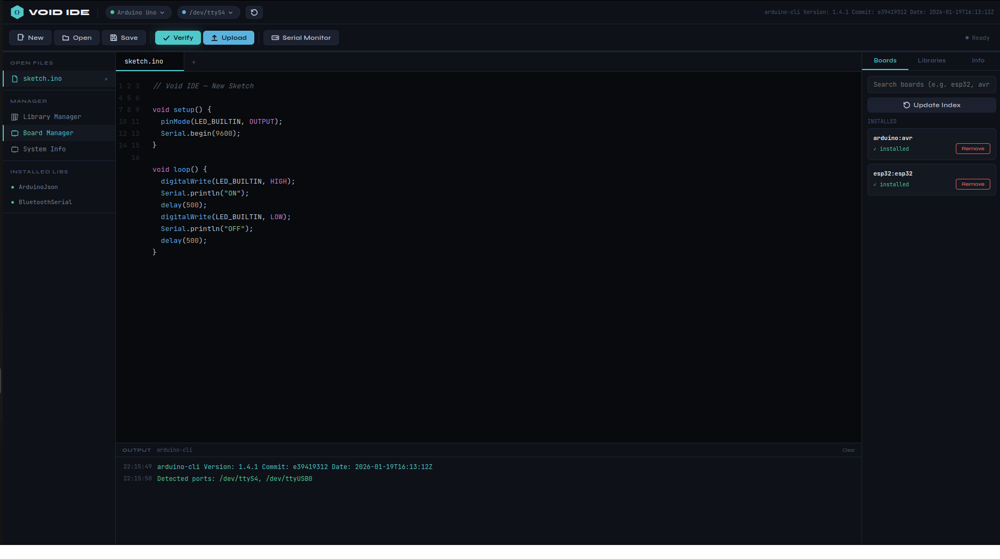

<p align="center">
  
</p>

<h1 align="center">Void IDE</h1>

<p align="center">
  A modern, minimal Arduino IDE built with React + Electron + arduino-cli.<br/>
  Dark theme. Real compilation. Real uploads. Real serial monitor.
</p>

<p align="center">
  
  
  
  
</p>

---

## Install via APT

```bash
curl -fsSL https://ronishnadar.github.io/void-ide/void-ide.gpg | sudo gpg --dearmor -o /etc/apt/keyrings/void-ide.gpg
echo "deb [signed-by=/etc/apt/keyrings/void-ide.gpg] https://ronishnadar.github.io/void-ide/apt stable main" | sudo tee /etc/apt/sources.list.d/void-ide.list
sudo apt update && sudo apt install void-ide
```

> **Log out and back in** after first install for serial port access to take effect.

---

## Features

- **Auto-installs arduino-cli** on first launch if not found
- **VSCode-style file explorer** — project folders with all `.ino`, `.h`, `.cpp`, `.c` files visible, inline rename, move to trash
- **Multi-file sketch support** — add `.h` and `.cpp` files to any sketch, grouped by project
- **Draggable tabs** — reorder open files by dragging
- **Board Manager** — search and install any core (AVR, ESP32, ESP8266, RP2040, SAMD, STM32, and more)
- **Library Manager** — search, install, and uninstall libraries from the Arduino registry
- **Examples browser** — browse examples from installed libraries
- **Serial Monitor** — connect to any port, send and receive data, configurable baud rate
- **Auto port and board detection** — detects connected boards and auto-selects port and FQBN
- **Syntax highlighting** — real-time client-side check + deep arduino-cli compile check
- **Error markers** — gutter dots with hover tooltips, line highlighting
- **Split output panel** — Summary tab (errors, warnings, memory usage) and Full Log tab (raw CLI output)
- **Light / dark theme** toggle
- **Native file dialogs** — open and save `.ino` sketches via OS file picker
- **Packages as `.deb`** — installs to Show Applications like a native Linux app

---

## Screenshots



---

## Requirements

- **Ubuntu / Debian Linux** (tested on Ubuntu 22.04+)
- **Node.js 18+** and **npm**
- **Python 3** with **Pillow** (for icon generation)
- Internet connection on first launch (to download arduino-cli)

---

## Build from Source

### 1. Clone the repo

```bash
git clone https://github.com/RonishNadar/void-ide.git
cd void-ide
```

### 2. Install Node dependencies

```bash
npm install
```

### 3. Generate icons

```bash
pip3 install Pillow
python3 scripts/generate_icon.py
```

### 4. Fix Electron sandbox permissions (Linux)

```bash
sudo chown root:root node_modules/electron/dist/chrome-sandbox
sudo chmod 4755 node_modules/electron/dist/chrome-sandbox
```

### 5. Run in development mode

```bash
npm run dev
```

This starts the React dev server and opens the Electron window. On first launch, Void IDE will detect that `arduino-cli` is missing and walk you through installing it automatically.

> **Note:** Do not use the browser tab that React opens — always use the Electron window.

---

## Build & Install as a native `.deb`

```bash
npm run dist:deb
sudo dpkg -i dist/void-ide_1.0.0_amd64.deb
```

After installation, **Void IDE** appears in Show Applications with its icon. The post-install script automatically:
- Adds your user to the `dialout` group (required for serial port access)
- Sets up udev rules for Arduino USB devices (CH340, CP210x, ATmega16U2)
- Creates `~/VoidSketches/` as your default sketch folder
- Patches the `.desktop` entry with `--no-sandbox` for correct launch on Linux

### Uninstall

```bash
sudo dpkg --purge void-ide
```

---

## Connecting your Arduino

If your board is not detected after installing:

```bash
sudo usermod -aG dialout $USER
# Log out and back in, then verify
arduino-cli board list
```

For **Arduino Nano clones** (CH340 chip):

```bash
sudo apt install linux-modules-extra-$(uname -r)
```

Then unplug and replug your board.

---

## Project Structure

```
void-ide/
├── .github/
│   └── workflows/
│       └── release.yml     ← Builds .deb and publishes APT repo on version tag
├── electron/
│   ├── main.js             ← Electron main process, arduino-cli IPC bridge, serial monitor
│   └── preload.js          ← Secure contextBridge — exposes window.voidIDE to React
├── src/
│   ├── VoidIDE.jsx         ← Entire IDE UI
│   └── index.js            ← React entry point
├── public/
│   └── index.html
├── assets/
│   ├── icon.png            ← 512x512 app icon
│   └── icons/              ← Multi-size icons for electron-builder (16–512px)
├── scripts/
│   ├── generate_icon.py    ← Generates all icon sizes using Pillow
│   ├── setup-gpg.sh        ← One-time GPG key setup for APT repo signing
│   ├── postinstall.sh      ← Runs after dpkg install
│   └── postremove.sh       ← Runs after dpkg removal
└── package.json
```

---

## Releasing a New Version

```bash
# Bump version in package.json, then:
git tag v1.1.0
git push origin v1.1.0
```

GitHub Actions will automatically build the `.deb`, create a GitHub Release, and update the APT repository.

---

## How It Works

Void IDE uses Electron's **IPC bridge** to communicate between the React UI and the system:

- `window.voidIDE.compile({ fqbn, sketchDir })` → spawns `arduino-cli compile --fqbn ... --verbose`
- `window.voidIDE.upload({ fqbn, port, sketchDir })` → spawns `arduino-cli upload -p ... --fqbn ...`
- `window.voidIDE.serialOpen({ port, baud })` → spawns `arduino-cli monitor -p ... --config baudrate=...`
- `window.voidIDE.libSearch(query)` → runs `arduino-cli lib search` and returns JSON results
- `window.voidIDE.coreSearch(query)` → runs `arduino-cli core search` and returns JSON results

All CLI output is streamed line-by-line back to the output console in real time.

---

## Supported Boards (out of the box)

| Board | FQBN |
|---|---|
| Arduino Uno | `arduino:avr:uno` |
| Arduino Nano | `arduino:avr:nano` |
| Arduino Mega 2560 | `arduino:avr:mega` |
| Arduino Leonardo | `arduino:avr:leonardo` |
| Arduino Micro | `arduino:avr:micro` |
| Arduino Pro Mini | `arduino:avr:pro` |

Any board supported by arduino-cli can be added via the **Board Manager** tab.

---

## License

MIT © Ronish Nadar
